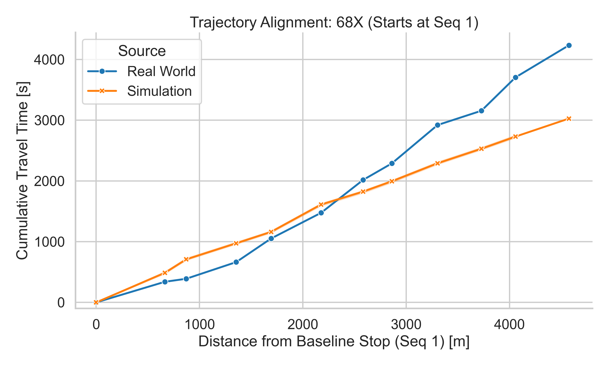
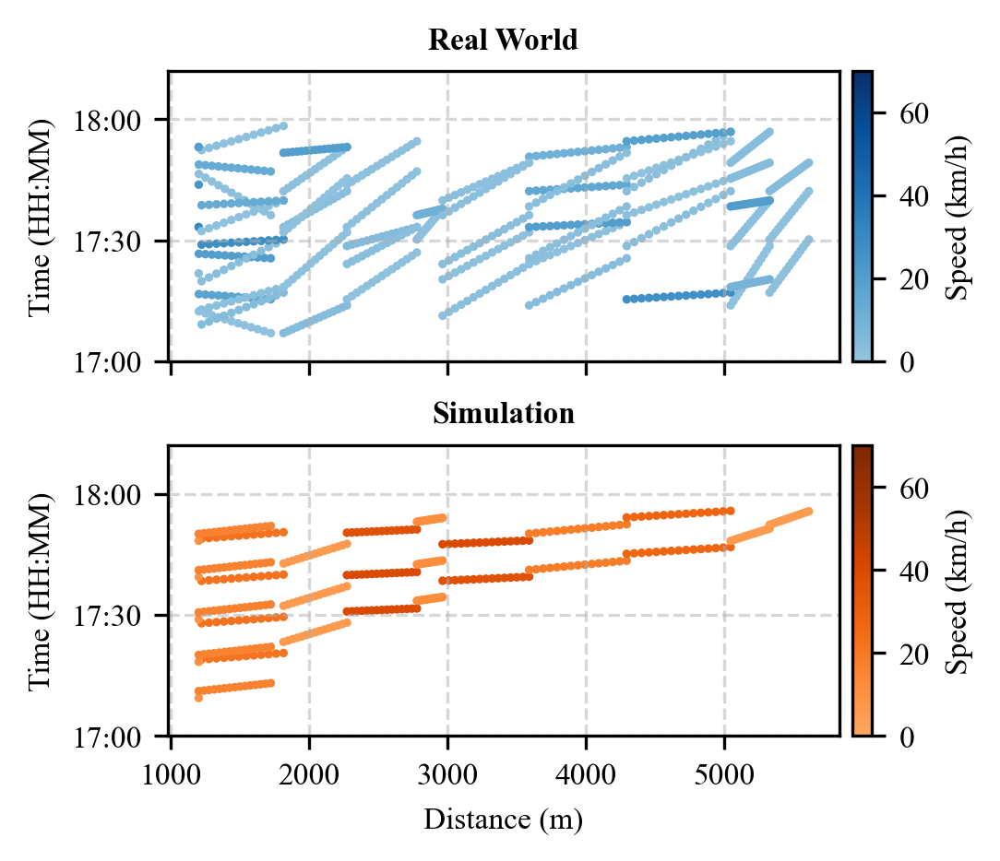
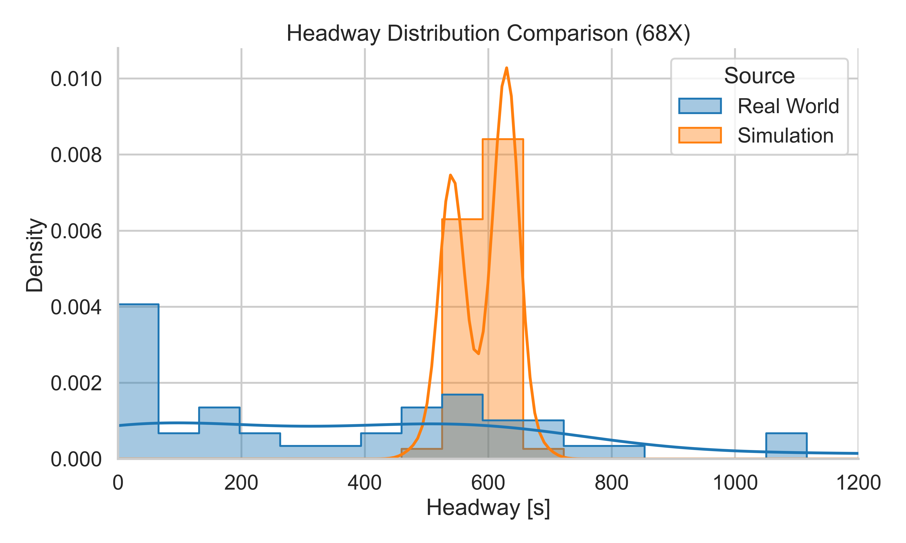
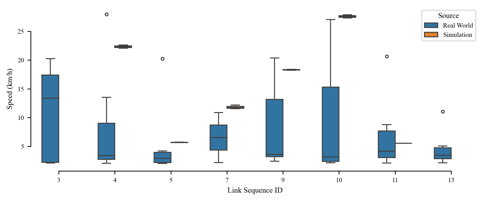
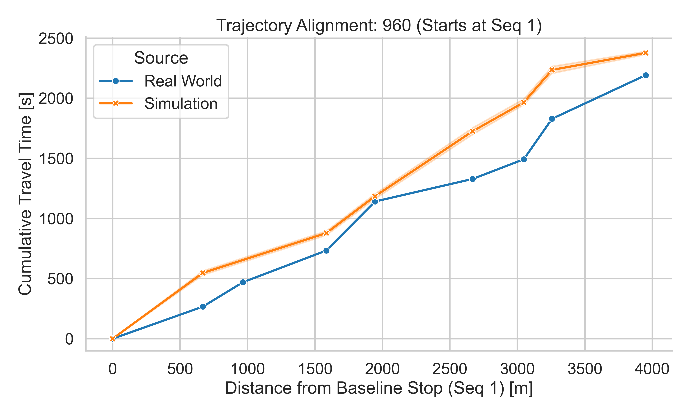
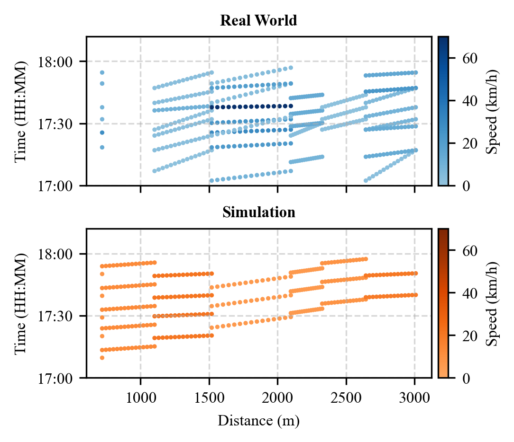
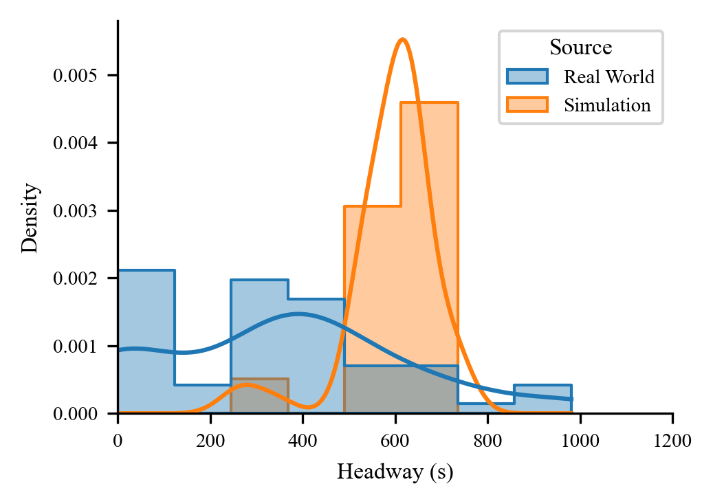
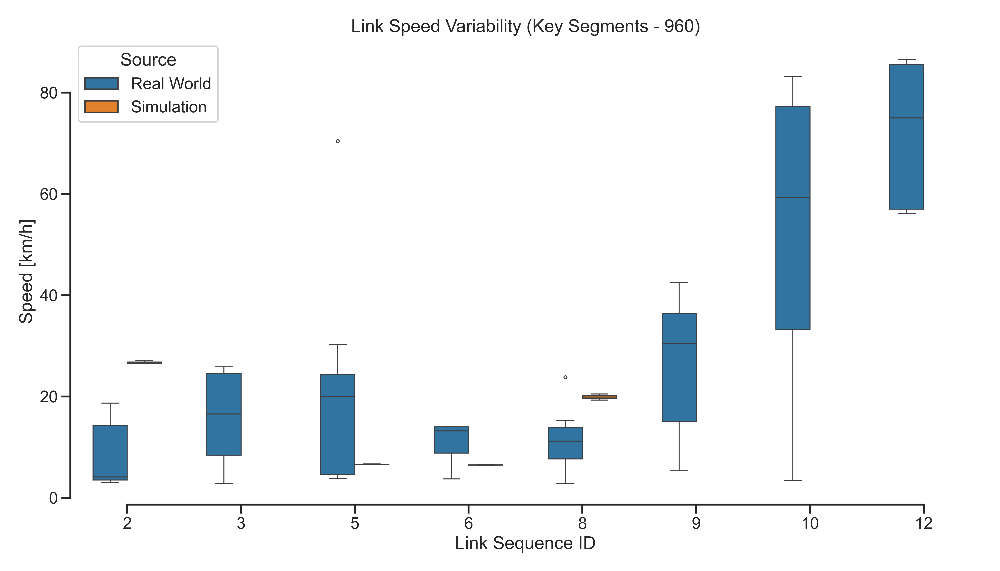

# 仿真基准评估报告 (Baseline Evaluation Report)

## 实验背景
本报告评估了 **Week 2 Experiment 2.3** 的仿真表现 (Baseline)。

## 1. 核心指标统计 (Key Metrics)

### Route 68X
- **RMSE**: 148.00 s
- **MAPE**: 43.56 %

#### 可视化 (Visuals - 68X)

**Cumulative Trajectory**

**Space-Time Diagram**

**Headway Distribution**

**Link Speed Boxplot**

---

### Route 960
- **RMSE**: 312.35 s
- **MAPE**: 31.58 %

#### 可视化 (Visuals - 960)

**Cumulative Trajectory**

**Space-Time Diagram**

**Headway Distribution**

**Link Speed Boxplot**

---

